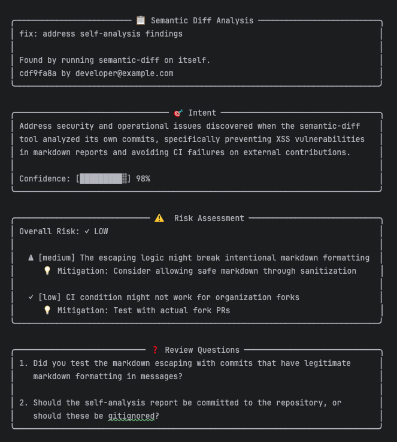
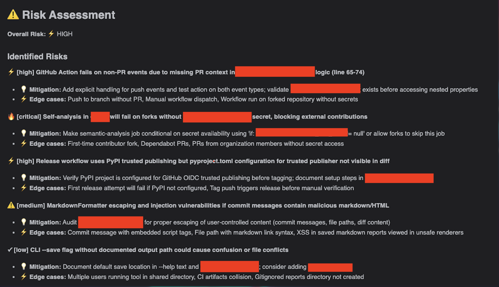

# semantic-diff

[](https://pypi.org/project/semantic-diff/)
[](https://opensource.org/licenses/MIT)

AI-powered semantic analysis of git commits. Goes beyond `git diff` to show **intent**, **impact**, **risk**, and **review questions**.

## What it does

Regular `git diff` shows *what* changed. `semantic-diff` shows:

| | git diff | semantic-diff |
|---|---|---|
| **What** | Lines added/removed | Same |
| **Why** | - | Intent behind the change |
| **Risk** | - | What could break, edge cases |
| **Impact** | - | Direct and indirect effects |
| **Review** | - | Questions to ask the author |

## Installation

```bash
pip install semantic-diff
```

## Quick Start

```bash
# Set your API key
export ANTHROPIC_API_KEY=sk-ant-...

# Analyze a commit
semantic-diff HEAD

# Enable automatic analysis before every push
semantic-diff init
```

That's it! Now every `git push` will automatically analyze your commits and save reports.

## How It Works

### Manual Analysis

```bash
# Analyze HEAD commit
semantic-diff

# Analyze specific commit
semantic-diff abc123

# Save report to file
semantic-diff HEAD --save

# Output as JSON
semantic-diff HEAD --json
```

### Automatic Analysis (Pre-Push Hook)

```bash
# Install the hook (once per project)
semantic-diff init

# Now every push triggers analysis automatically
git push  # → runs semantic-diff, saves report, then pushes
```

### Reports

Reports are saved to `semantic_diff_reports/` in your project root:

```
my-project/
├── semantic_diff_reports/
│   ├── abc12345_20240115_143022.md
│   ├── def67890_20240115_152341.md
│   └── ...
├── src/
└── ...
```

Each report includes:
- Commit metadata
- Intent analysis with confidence score
- Impact map (direct and indirect effects)
- Risk assessment with mitigations
- Review questions prioritized by importance

### GitHub Action

Add to your workflow to analyze PRs automatically:

```yaml
# .github/workflows/semantic-diff.yml
name: Semantic Diff

on: [pull_request]

jobs:
  analyze:
    runs-on: ubuntu-latest
    steps:
      - uses: actions/checkout@v4
        with:
          fetch-depth: 0

      - uses: tkenaz/semantic_diff@v0.2.0
        with:
          anthropic_api_key: ${{ secrets.ANTHROPIC_API_KEY }}
          comment_on_pr: true
          fail_on_risk: high  # optional: block merge on high risk
```

## Example Output

### Analysis Overview



*Intent analysis with 98% confidence, risk assessment, and review questions*

### What It Finds



*Real example: semantic-diff analyzing itself found XSS vulnerabilities, CI issues, and security misconfigurations*

## Configuration

Create a `.env` file in your project or set environment variables:

```bash
# Required
ANTHROPIC_API_KEY=sk-ant-...

# Optional
SEMANTIC_DIFF_MODEL=claude-sonnet-4-5-20250929  # or claude-opus-4-5-20251101
```

## Commands

| Command | Description |
|---------|-------------|
| `semantic-diff` | Analyze HEAD commit |
| `semantic-diff <hash>` | Analyze specific commit |
| `semantic-diff --save` | Save report to `semantic_diff_reports/` |
| `semantic-diff --json` | Output as JSON |
| `semantic-diff init` | Install pre-push hook |
| `semantic-diff uninstall` | Remove pre-push hook |

## Development

```bash
git clone https://github.com/tkenaz/semantic_diff.git
cd semantic_diff
pip install -e ".[dev]"
pytest
```

## Support

- **Bug reports & features**: [GitHub Issues](https://github.com/tkenaz/semantic_diff/issues)
- **Custom integrations or enterprise**: [hello@kenaz.ai](mailto:hello@kenaz.ai)

## License

MIT — [Kenaz GmbH](https://kenaz.ai)

---

*Built with 🖤 by [Kenaz GmbH](https://kenaz.ai) — AI tools for developers*
